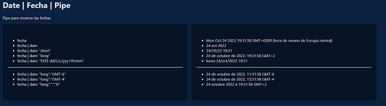

 <!-- title: Apuntes Angular -->

-   [Apuntes-Curso-Angular](#apuntes-curso-angular)
    -   [01_Bases](#01_bases)
        -   [Comunicación entre vista y controlador - [(ngModel)] - {{atributo}}](#comunicación-entre-vista-y-controlador---ngmodel---atributo)
        -   [Comunicación entre componente padre e hijo - @Input()](#comunicación-entre-componente-padre-e-hijo---input)
        -   [Comunicación entre componente hijo y padre - @Output - EventEmitter](#comunicación-entre-componente-hijo-y-padre---output---eventemitter)
        -   [Servicios](#servicios)
    -   [02_Gifs App](#02_gifs-app)
        -   [@ViewChild (aplicado a elementos del DOM)](#viewchild-aplicado-a-elementos-del-dom)
        -   [Comunicación con una API - Angular HTTP](#comunicación-con-una-api---angular-http)
        -   [Tipado de una respuesta](#tipado-de-una-respuesta)
        -   [Persistencia de Información - LocalStorage](#persistencia-de-información---localstorage)
        -   [Animate.css](#animatecss)
    -   [03_PaisesApp](#03_paisesapp)
        -   [Rutas Básico. Creación, Implementación](#rutas-básico-creación-implementación)
        -   [Manejo errores en http](#manejo-errores-en-http)
        -   [DebounceTime](#debouncetime)
            -   [Input.Component](#inputcomponent)
            -   [Input.Html](#inputhtml)
        -   [Utilización del Input para mostrar resultados sugeridos](#utilización-del-input-para-mostrar-resultados-sugeridos)
        -   [ngClass, class y [class]](#ngclass-class-y-class)
    -   [04_PipesApp](#04_pipesapp)
        -   [PrimeNg](#primeng)
        -   [PrimeFLex](#primeflex)
        -   [Pipes Básicos](#pipes-básicos)
        -   [Cambiar el Locale](#cambiar-el-locale)
        -   [Pipes Numericos](#pipes-numericos)
        -   [Pipes no Comunes](#pipes-no-comunes)
        -   [Pipes Personalizados](#pipes-personalizados)
        -   [Pipes Puros e impuros](#pipes-puros-e-impuros)
    -   [05_HeroesApp](#05_heroesapp)
        -   [Angular Material](#angular-material)
        -   [Angular Flex-Layout (Deprecated)](#angular-flex-layout-deprecated)
        -   [Estructura de nuestra aplicación](#estructura-de-nuestra-aplicación)
        -   [Rutas - Rutas Hijas, LazyLoad](#rutas---rutas-hijas-lazyload)
        -   [Componentes de Angular Material](#componentes-de-angular-material)
            -   [Sidenav](#sidenav)
        -   [JSON Server](#json-server)
        -   [Continuación del Proyecto](#continuación-del-proyecto)
        -   [Pipe para manejar Imagenes](#pipe-para-manejar-imagenes)
        -   [Creación de un Spinner para el loader](#creación-de-un-spinner-para-el-loader)
        -   [Router.navigate Router.navigateByUrl](#routernavigate-routernavigatebyurl)
        -   [Manejo de los Enviroments](#manejo-de-los-enviroments)
        -   [Angular Material Autocomplete](#angular-material-autocomplete)
        -   [Creación del CRUD completo para leer, crear, editar y borrar](#creación-del-crud-completo-para-leer-crear-editar-y-borrar)
        -   [SnackBar](#snackbar)
        -   [Dialog](#dialog)

# Apuntes-Curso-Angular

-   Apuntes extraidos del curso de angular de Fernando Herrera organizados en relización a las secciones del curso y las aplicaciones desarroyadas en él mismo

---

## 01_Bases

-   **Instalación de Angular** `npm install -g @angular/cli` instalará angular CLI en modo global.
-   [Documentación](https://angular.io/cli) relativa a angular/cli
-   Angular se compone de los siguientes bloques fundamentales:
    -   **Componentes** : se compone de HTML y lógica en typescript
    -   **Rutas**: Mostrar diferentes componetes basados en rutas URL del navegador web
    -   **Directivas**: Directivas de componentes directivas estructurales y directivas de atributos
    -   **Servicio** : Lugares centrales para el manejo de información
    -   **Módulos**: Nos permite agrupar los anteriores bloques anteriores incluso otros módulos
-   Creación de un proyecto con Angular
    -   `ng new nombreProyecto`
    -   `ng serve -o` -> arranca el proyecto y lo ejecuta en el navegador
-   **Enlace de una via** entre la lógica y la vista html. para ello basta con indicar en el html el nombre de la propiedad entre doble llave `{{titulo}}`
-   Entre estas llaves no solo se puede poner propiedades, sino tambien expresiones javascript
-   Podemos vincular un **evento** a un elemento del DOM e indicarle un método a realizar
    -   `<button (click)="acumular(1)">+1</button>`
-   Crear un componente de manera automática:
    -   `ng generate componente <carpeta>/nombreComponente`
-   Directiva estructural **NgFor**

```html
<ul>
    <li *ngFor="let heroe of heroes; let i = index">
        {{ i + 1 }} - {{ heroe }}
    </li>
</ul>
```

-   Directiva estructural **NgIf** **ng-template**

```html
<div class="d-block" *ngIf="heroeBorrado; else noBorrado">
    <span>Heroe Borrado: </span>
    <span>{{heroeBorrado}}</span>
</div>
<ng-template #noBorrado>
    <span class="d-block">Na ha borrado ningún heroe</span>
</ng-template>
```

-   Observese la creación de una referencia local `#noBorrado`

### Comunicación entre vista y controlador - [(ngModel)] - {{atributo}}

-   Además de la comunicación mediante binding por interpolación `{{}}` entre vista y controlador, también existe el _two way data binding_ en este caso mediante la directiva ngModel `[(ngModel)]`
-   Una de las opciones que tenemos para realizar esta comunicación es a través de formularios. (se tratarán en detalle más adelante)
-   Para cosas sencillas se puede utilizar el FormsModule
-   Importarmos formsModule en el modulo donde se encuetra nuestro componente
-   `import { FormsModule } from '@angular/forms';`
-   En la vista ya podemos hacer uso de la directiva `ngSubmit` para tomar el control del formulario cuando se presiona el botón submit

```html
<form (ngSubmit)="metodoSubmit()">
    <input type="text" name="nombre" [(ngModel)]="nuevo.nombre" />
    <button type="submit">Agregar</button>
</form>
```

-   La directiva `[(ngModel)]` vincula en dos direcciones el contenido de la vista con un atributo del controlador. Importante incluir en el input el atributo `name="loquesea"` para que funcione correctamente ngModel

### Comunicación entre componente padre e hijo - @Input()

-   Una forma de pasar información del componente padre a un componente hijo es mediante el uso del `@Input`
-   En el componente hijo creamos `@Input() nuevo!: Personaje;`
-   y en la vista del componente padre. en el `<app-hijo [nuevo]="personajeInicial"></app-hijo>`
-   en el controlador del padre tendremos ese atributo que será el que le pasemos al hijo

```javascript
public personajeInicial: Personaje = {
    nombre: 'santos',
    poder: 500,
  };
```

### Comunicación entre componente hijo y padre - @Output - EventEmitter

-   Para esto tenemos que crear en el componente hijo la "salida" `@Output()`
-   La crearemos de la siguiente manera `@Output() comunicaInsercion = new EventEmitter<Personaje>();`
-   Luego, en la vista, bien como evento de un botón, submit de un formulario, etc... En el control del evento haremos uso de ese atributo creado de tipo eventEmitter
-   En la parte del genérico indicaremos el tipo que se va a emitir. En este caso un objeto de tipo `Personaje`

```Typescript
agregar() {
    this.comunicaInsercion.emit({
      nombre: this.nuevo.nombre,
      poder: this.nuevo.poder,
    });
```

-   Observese el uso de la instancia eventEmitter, su metodo `emit` será el encargado de emitir al componente padre el objeto `Personaje`
-   El componente padre lo recibirá como argumento en su propio método de la siguiente forma:

```html
<div class="col-4">
    <app-agregar
        [nuevo]="personajeInicial"
        (comunicaInsercion)="recibeInsercion($event)"
    ></app-agregar>
</div>
```

-   donde `$event` será el objeto de tipo `Personaje`

### Servicios

-   su función es la de manejar la información y metodos para interactuar con fuentes de información externas
-   Este punto de encuentro de información puede ser accesible bien desde los componentes de un módulo en concreto o bien desde toda la aplicación.
    -   Para esto puede ser proveido en el propio módulo indicándose en el aparatado `providers`
    -   ...O puede ser proveido de manera global indicandolo en el decorador del servicio

```javascript
@Injectable({
  providedIn: 'root',
})
```

-   Para hacer uso de un servicion concreto hay que inyectarlo en el componente que lo requiera **(Inyección de dependencias)**
-   `constructor(private service: Service){}`

---

## 02_Gifs App

-   Esta aplicación está diseñada gráficamente en base a **bootstrap**
-   Incorporamos bootstrap a nuestra aplicaióna través del CDN del própio bootstrap insertandolo en nuestro archivo `index.html`

```html
<link
    href="https://cdn.jsdelivr.net/npm/bootstrap@5.2.2/dist/css/bootstrap.min.css"
    rel="stylesheet"
    integrity="sha384-Zenh87qX5JnK2Jl0vWa8Ck2rdkQ2Bzep5IDxbcnCeuOxjzrPF/et3URy9Bv1WTRi"
    crossorigin="anonymous"
/>
```

-   **Tip**: A la hora de devolver un array con desde algún servicio, es conveniente devolverlo mediante el Spread Operator para romper la relación entre el array devuelto y el original. La función de esto es para evitar que se pueda manipular el array original del servicion fuera de este.

```javascript
get getArrayPrivado(){
    return [...this.arrayPrivado]
}
```

### @ViewChild (aplicado a elementos del DOM)

-   Este decorador sireve para vincular un elemento del DOM y el controlador.
-   En la vista:

```html
<input #textoEntrada type="text" (keyUp.enter)="busqueda()" />
```

-   Vinculandolo en el controlador

```javascript
@ViewChild('textoEntrada ') busqueda!: ElementRef;
```

-   Utilizándolo en el método busqueda

```javascript
busqueda() {
    const terminoBusqueda = this.busqueda.nativeElement.value;
}
```

### Comunicación con una API - Angular HTTP

-   Para esta aplicación se hace uso del API [Giphy](https://developers.giphy.com/)
-   Para la comunicación de la aplicación con el API utilizamos el módulo de **Angular HTTP**
-   Lo importamos en nuestro `app.module.ts`

```javascript
import { HttpClientModule } from '@angular/common/http'
```

-   En el servicion donde vamos a realizar el trabajo de comunicación con la API inyectamos el servicio http

```javascript
import { HttpClient, HttpParams } from '@angular/common/http';
.
.
constructor(private http: HttpClient) {}
```

-   Ahora ya podemos hacer uso del objeto http el cual nos proporciona todo lo necesario para trabajar con el protocolo HTTP
-   Existen muchas ventajas para trabajar en base a http Angular, entre otras, el uso de los Observables
-   Ejemplo petición http.get con **params**
    -   Params nos permite configurar una petición de este tipo:
    -   https://api.giphy.com/v1/gifs/search?api_key=1TpDBYvXGJfoUHuwM20R3wKIOR0cgtEb&q=car&limit=10
    -   Observese en esta petición los parámetros "api_key", "q", "limit"

```javascript
busquedaApi(terminoBusqueda: string) {
    const params = new HttpParams()
      .set('api_key', this.apiKey)
      .set('q', terminoBusqueda)
      .set('limit', 12);

    this.http
      .get<Gifs>(this.urlGiphy, { params })
      .pipe(map((res) => res.data))
      .subscribe((resp) => {
        this._arrayResp = resp;
      });
  }
```

### Tipado de una respuesta

-   Es conveniente realizar este tipado para poder ir viendo todos las propiedades de un objeto de tipo respuestas
-   La herramienta que se usará para esta función es la página [QuickType](https://quicktype.io/)
-   Tan solo hay que copiar la respuesta de una petición en esa página y automáticamente tendremos la configuración de una interface con el tipado

### Persistencia de Información - LocalStorage

-   Es un método que tenemos para almacenar información en nuestro navegador y hacerla persistente

```javascript
localStorage.setItem('clave', JSON.stringify(this._infoLocalStorage);
```

-   Recuperar información del localStorage

```javascript
this._infoLocalStorage = JSON.parse(
    localStorage.getItem('arrayBusquedas') || '[]'
)
```

-   Observese el uso del objeto global `JSON` para convertir un objeto en string y un string en objeto (localStorage sólo almacena strings)
-   **Tip**: para manejar la información en el localStorage, array de strings y demás es conveniente manejarla en minúsculas y sin espacios antes y después del string. Para que a la hora de buscar, coincidencias, etc... no nos surja ningún error `this.almacenaEnLocalStorage(terminoBusqueda.trim().toLowerCase());`
-   Luego, si en la vista queremos que aparezcan esos strings bien capitalizados, únicamente tenemos que pasarlos por el pipe `{item | Tittlecase}` Se verá detenidamente los Pipes más adelante

### Animate.css

-   Es una libreria que nos permite mejorar la visualización de los elementos en la vista que aparecen y desaparecen bruscamente.
-   Para ello utilizaremos la libreria [Animate.css](https://animate.style/)
-   Hay varias formas de insertarla en nuestro proyecto, una de ellas es mediante el CDN en el `index.html`

```html
<link
    rel="stylesheet"
    href="https://cdnjs.cloudflare.com/ajax/libs/animate.css/4.1.1/animate.min.css"
/>
```

-   Luego, únicamente tenemos que incluir en elemento que queramos realizar la mejora de la visualización la clase:
-   `class="animate__animated animate__fadeIn"`
-   Reivisar la documentación de la página oficial para ver más efectos

---

## 03_PaisesApp

-   En esta aplicación estaremos consumiendo la Api [RestCoutries](https://restcountries.com/)
-   También haremos uso de **BootStrap** para realizar la maquetación gráfica

### Rutas Básico. Creación, Implementación

-   La configuración de las rutas se define dentro del archivo `app-routing.module.ts`
-   Ejemplo de la configuración del archivo en la aplicación Paises_App

```typescript
import { NgModule } from '@angular/core'
import { RouterModule, Routes } from '@angular/router'
import ...Todos los restantes componentes

const routes: Routes = [
    {
        path: '',
        component: PorPaisComponent,
        pathMatch: 'full',
    },
    {
        path: 'region',
        component: PorRegionComponent,
    },
    {
        path: 'capital',
        component: PorCapitalComponent,
    },
    {
        path: 'pais/:id',
        component: VerPaisComponent,
    },
    {
        path: '**',
        redirectTo: '',
    },
]

@NgModule({
    imports: [RouterModule.forRoot(routes)],
    exports: [RouterModule],
})
export class AppRoutingModule {}
```

-   Este archivo `app-routing.module` tenemos que importarlo dentro de nuestro módulo principal de nuestra aplicación; `app.module.ts`
-   Luego, para poder ir visualizando cada uno de los componentes (páginas) que se encuentran enrutadas, tendremos que indicar en la vista contenedora de nuestras páginas la etiqueta que habilita esta visualizacion `<router-outlet></router-outlet>`.
    -   Esta directiva podemos utilizarla porque en el módulo donde se encuentra la vista tenemos importado el `app-routing.module` o en su defecto el `RouterModule`
-   En la parte vista que se encarga de seleccionar la vista a visualizar, en el elemento html correspondiente, deberemos indicar el atributo `routerLink="path_donde_navegar"` Este atributo lo podemos utilizar porque tenemos importado en nuestra aplicación el `RouterModule` en el módulo donde pertenezca la vista (si es en el app.module estará incluido en el `app-routing.module`)

```html
<li
    routerLink="region"
    routerLinkActive="active"
    class="list-group-item list-group-item-action"
>
    Buscar Región
</li>
```

-   Con el `routerLinkActive` indicamos al elemento html la clase que deberemos añadir cuando la ruta actual se encuentre activada (`active` es una clase propia de bootstrap)
-   En el caso de que la ruta indicada sea un string vacío `''` (página inicial mostrada), tenemos que incluir una atributo especial para que detecte correctamente cuando ese path se encuentra activo `[routerLinkActiveOptions]="{ exact: true }"`
-   Un caso similar lo vemos en la configuración de nuestras rutas en `app-routing.module`, donde tenemos que indicarle `pathMatch: 'full'`

```typescript
{
    path: '',
    component: PorPaisComponent,
    pathMatch: 'full',
},
```

-   Para manejar la ruta cuando hay que pasarle el `ruta/:Id` como es el caso del `{Path: pais/:id}` en el `[RouterLink]` del elemento vista que lo enruta, tenemos que indicarle el id de la siguiente manera:

```html
<a [RouterLink]="['/pais', pais.alphaCode]"></a>
```

-   En el Componente que se tiene que activar cuando estamos en la ruta `/pais`, tenemos que cazar el `alphaCode` que se envia en la ruta. Para ello lo mas recomendable es subscribirnos a un observable que está pendiente de los cambios en la ruta del navegador mediante `ActivatedRoute`

```typescript
constructor(
    private activatedRouted: ActivatedRoute,
    private paisService: PaisService
  ) {}

  ngOnInit(): void {
    this.activatedRouted.params
      .pipe(
        switchMap(({ id }) => this.paisService.buscarPaisPorCodigo(id)),
        tap(console.log)
      )
      .subscribe((pais) => (this.pais = pais));
  }
```

-   Observese en el código de arriba el uso de operador RXJS `switchMap`. Este operador lo que hace es encadenar Observables. Hace algo con la respuesta de un Observable y devuelve otro Observable.
-   También tenemos el operador `tap` el cual es un operador que no realiza ningua operación como tal, sino que va a recibir el resultado del observable y lo va a dejar pasar sin más. Podemos aprovechar este comportamiento, por ejemplo para realizar un `console.log()`

### Manejo errores en http

-   En esta sección también se hace uso del retorno de `Observables` en las peticiones del servicio. Será el metodo que llama a este servicio el que tendrá que gestionar el `subscribe`

```typescript
return this.http.get(url)
```

-   Hay varias formas de manejar un error en la petición Http. Por un lado, en la própia petición se puede capturar mediante un `catchError` (RXJS) en un `pipe` de la petición.

```javascript
return this.http.get(url).pipe(catchError((err) => of([])))
```

-   ...y Por otro, en el propio `subscribe`,

```javascript
Observable.subscribe(next:(res)=>{}, error: (err)=>{
    this.hayError = true
})
```

-   De esta forma, podemos enviar de vuelta un objeto/array vacío o cambiar el valor de un atributo booleano para mostrar o no un `Template` de error en la vista

### DebounceTime

-   DebounceTime es un operador `RXJS` que maneja la entrada de información y la salida de esta.
    -   solo emite la salida cuando ha pasado un tiempo desde la última entrada.
    -   Si antes de que haya pasado ese tiempo vuelve a recibir una entrada, el contador de tiempo se resetea
-   El uso práctico en esta aplicación es la utilización en un **Input de búsqueda**. realizará la búsqueda del término mientras se teclea, pero no realizará la petición hasta que haya pasado 300ms desde la pulsación de la última tecla
-   Más información e información de como implementarlo mediante formularios Reactivos es [este enlace](https://es.stackoverflow.com/questions/201596/como-prolongar-la-ejecuci%C3%B3n-de-un-evento-en-un-input)

#### Input.Component

```typescript
import { Component, EventEmitter, Output, OnInit, Input } from '@angular/core'
import { debounceTime, Subject } from 'rxjs'

@Component({
    selector: 'app-pais-input',
    templateUrl: './pais-input.component.html',
    styleUrls: ['./pais-input.component.css'],
})
export class PaisInputComponent implements OnInit {
    termino: string = ''
    subject: Subject<string> = new Subject()

    @Input() textoPlaceholder: string = ''
    @Output() onEnter: EventEmitter<string> = new EventEmitter()
    @Output() onDebouncer: EventEmitter<string> = new EventEmitter()

    ngOnInit() {
        this.subject.pipe(debounceTime(300)).subscribe((terminoDebouncer) => {
            this.onDebouncer.emit(terminoDebouncer)
        })
    }

    buscar() {
        this.onEnter.emit(this.termino)
    }

    teclaPresionada() {
        this.subject.next(this.termino)
    }
}
```

#### Input.Html

```html
<form (ngSubmit)="buscar()" autocomplete="off">
    <input
        type="text"
        [placeholder]="textoPlaceholder"
        name="termino"
        class="form-control"
        [(ngModel)]="termino"
        (input)="teclaPresionada()"
    />
</form>
```

### Utilización del Input para mostrar resultados sugeridos

-   Mediante la emisión del Observable del dobounceTime, gestionamos la visualización de una tabla de posibles resultados de la búsqueda
-   En el componente Padre, donde se incluye tanto en `<app-Input>` cómo el `<app-sujerencia>` tenemos el siguiente contenido y su control asociado
-   **Mostrar Sujerencias**

```html
<app-pais-input
    textoPlaceholder="Buscar País..."
    (onEnter)="buscar($event)"
    (onDebouncer)="sugerencia($event)"
>
</app-pais-input>
```

```typescript
sugerencia(termino: string) {
    this.hayError = false;
    this.paises = [];

    this.paisService.buscarPais(termino).subscribe({
      next: (paises) => (this.paisesSugeridos = paises.splice(0, 5)),
      error: (err) => (this.paisesSugeridos = []),
    });

    if (termino.length == 0) this.paisesSugeridos = [];
  }
```

-   **Seleccionar Sujerencia**

```html
<app-pais-sugerencias
    [tipo]="'pais'"
    [paisesSugeridos]="paisesSugeridos"
    (onSeleccionSugerido)="buscar($event)"
></app-pais-sugerencias>
```

```typescript
buscar(termino: string) {
    this.termino = termino;
    this.hayError = false;
    this.paisService.buscarPais(this.termino).subscribe({
      next: (paises) => {
        this.paises = paises;
        this.termino = '';
        this.paisesSugeridos = [];
      },
      error: (err) => {
        this.hayError = true;
        this.paises = [];
      },
    });
  }
```

### ngClass, class y [class]

-   Estos son tres formas de añadir clases a la vista de nuestro componente
-   **[class.estilo_Css]**
    -   `<button [class.btn-primary]="true/false">` cargará la clase btn-primary de acuerdo a una condición `(region === regionActiva)`
-   **[ngClass]={clase_Css: boolean}**
    ```html
    <button [ngClass]={ btn-primary: regionActiva === region,
    btn-outline-primary:regionActiva!== region } >
    ```
    -   Esto anterior se puede hacer de una forma más eficiente utilizando el operador ternario
-   **[class]**

```html
<button [class]="validarRegionActiva(region)"></button>
```

```typescript
validarRegionActiva(region: string){
    return region === this.regionActiva ? 'btn btn-primary' : 'btn btn-outline-primary'
}
```

## 04_PipesApp

-   La parte de maquetación de esta aplicación se encuntra desarrollada utilizando la libreria [**PrimeNg**](https://www.primefaces.org/primeng/)
-   Los pipes no modifican el valor del atributo al que se le aplica. Únicamente cambia su aspecto visual en la vista

### PrimeNg

-   Instalamos PrimeNg y PrimeIcons desde la terminal utilizando node

```
npm install primeng --save
npm install primeicons --save
```

-   Configuramos los estilos principales PrimeNg y el tema dentro del archivo `angular.json` en el apartado "styles":[]

```
"styles": [
    "node_modules/primeicons/primeicons.css",
    "node_modules/primeng/resources/themes/vela-blue/theme.css",
    "node_modules/primeng/resources/primeng.min.css",
    ...
]
```

-   Dentro del `theme.css` se encuentran las variables de entorno configurada con los estilos própios del tema. Para utilizarlos, únicamente tenemos que aplicarselos a nuestros componentes. Así, en el momento de seleccionar otro tema cambiará estas variables y el aspecto visual de nuestra vista

```css
html,
body {
    margin: 10px;
    margin-left: 5vw;
    margin-right: 5vw;
    background-color: var(--surface-d);
    font-family: var(--font-family);
}

.text-layout {
    color: var(--text-color);
}
```

-   Para la utilización de los distintos componentes de **primeNg** tenemos que ir importandolos en el módulo correspondiente
-   `import { ButtonModule } from 'primeng/button';`
-   Para luego ir insertandolos en nuestro documento. Para esto tenemos dos formas:

```html
<button pButton type="button" label="Click"></button>
<p-button label="Click"></p-button>
```

-   Una buena práctica para la utilización de los componentes de **PrimeNg** es centralizarlos en un mismo modulo y a continuación exportar este a los modulos donde nos sea preciso. Para eso crearemos un módulo llamado `prime-ng.module.ts` y dentro de este iremos importando y exportando todos los módulos de componentes a utilizar.
-   Cuando se va a utilizar un componente que tenga algún tipo de animación, hay que importar un modulo en **app.module.ts** aparte para que pueda trabajar correctamente

```typescript
import { BrowserAnimationsModule } from '@angular/platform-browser/animations'
```

-   Otra configuración que existe es para que al pulsar botones tenga **efecto de ondas** - burbujas. Para esto hay que realizar lo siguiente en el componente **app.component.ts** de nuestra aplicación:

```typescript
import { PrimeNGConfig } from 'primeng/api';
.
.
constructor(private primeNgConfig: PrimeNGConfig) {}
  ngOnInit(): void {
    this.primeNgConfig.ripple = true;
```

### PrimeFLex

-   Para utilizar este módulo tenemos que realizar su instalación `npm install primeflex --save`
-   Incluirlo en el apartado `styles: []` de nuestro **angular.json** `/node_modules/primeflex/primeflex.css`
-   Para uso de PrimeFlex, revisar la [documentación](https://www.primefaces.org/primeflex/)

### Pipes Básicos

-   Información de la [documentación oficial](https://angular.io/guide/pipes-overview)
    -   **UpperCase**: Trasnforma un texto a todo mayúsculas
    -   **LowerCase**: Transforma un texto a todo minúsculas
    -   **Titlecase**: Pone la primera letra de cada palabra en mayúsculas
    -   **Date**: Maneja formateo de la fecha. Revisar la amplia [documentación](https://angular.io/api/common/DatePipe)



-   **Tip:** Para manejar fechas, sumarlas, etc... se recomienda utilizar la libreria [MomentJs](https://momentjs.com/)

### Cambiar el Locale

-   Con el siguiente código cambiamos de idioma todo lo relacionado con la configuración de fechas, números, monedas, etc..
-   En el múdulo principal de nuestra aplicación `app.module.ts` incluimos lo siguiente:

```typescript
import localeEs from '@angular/common/locales/es'
import localeFr from '@angular/common/locales/fr'
import { registerLocaleData } from '@angular/common'
registerLocaleData(localeEs)
registerLocaleData(localeFr)
```

-   ...Y en el bloque de los `providers` esto otro:

```typescript
providers: [
    { provide: LOCALE_ID, useValue: 'es' },
    {
      provide: DEFAULT_CURRENCY_CODE,
      useValue: 'EUR',
    },
  ],
```

### Pipes Numericos

-   **DecimalPipe** ( | number: '1.2-2'): Maneja la parte entera y decimal de un número.
-   **CurrencyPipe** ( | currency: 'EUR':'symbol-narrow':'4.2-2') : Moneda
-   **PercentPipe** ( | percent)

### Pipes no Comunes

-   **i18nSelectPipe**: Maneja el contenido de una palabra según el sexo

```typescript
@Component({
    selector: 'i18n-select-pipe',
    template: `<div>{{ gender | i18nSelect: inviteMap }}</div>`,
})
export class I18nSelectPipeComponent {
    gender: string = 'male'
    inviteMap: any = {
        male: 'Invite him.',
        female: 'Invite her.',
        other: 'Invite them.',
    }
}
```

-   **i18nPluralPipe**: Maneja el contenido de una frase según las unidades

```typescript
@Component({
    selector: 'i18n-plural-pipe',
    template: `<div>{{ messages.length | i18nPlural: messageMapping }}</div>`,
})
export class I18nPluralPipeComponent {
    messages: any[] = ['Message 1']
    messageMapping: { [k: string]: string } = {
        '=0': 'No messages.',
        '=1': 'One message.',
        other: '# messages.',
    }
}
```

-   **SlicePipe**: ( | slice): permite cortar un arreglo
-   **KeyValuePipe**: ( | ): Permite mostrar objetos en formato **clave : valor** en la vista

```html
<ul>
    <li *ngFor="let item of persona | keyvalue">
        <b>{{ item.key | titlecase }}:</b> {{ item.value }}
    </li>
</ul>
```

-   **JsonPipe**: Permite mostrar objetos "en bruto" en la vista
-   **AsyncPipe**: Se le aplicac a Observables o promesas

### Pipes Personalizados

-   Crear Pipe Personalizado `ng g pipe pipes/mayusculas`

```typescript
import { Pipe, PipeTransform } from '@angular/core'

@Pipe({
    name: 'mayusculas',
})
export class MayusculasPipe implements PipeTransform {
    transform(valor: string, enMayusculas: boolean = true): string {
        if (enMayusculas) {
            return valor.toUpperCase()
        } else {
            return valor.toLowerCase()
        }
    }
}
```

```html
<p>Pipes creados por {{ "nosotros" | mayusculas: true }}</p>
```

-   **Tip:** Es posible encadenar Pipes `{{valor | primerPipe | segundoPipe}}`
-   Pipe personalizado para realizar ordenación, en este caso de una tabla de datos

```typescript
@Pipe({
    name: 'ordenar',
})
export class OrdenarPipe implements PipeTransform {
    transform(heroes: Heroes[], ordenarPor: string = 'no ordenar'): Heroes[] {
        if (ordenarPor === 'nombre') {
            heroes = heroes.sort((a, b) => {
                return a.nombre > b.nombre ? 1 : -1
            })
        }
        if (ordenarPor === 'vuela') {
            heroes = heroes.sort((a, b) => {
                return a.vuela > b.vuela ? 1 : -1
            })
        }
        if (ordenarPor === 'color') {
            heroes = heroes.sort((a, b) => {
                return a.color > b.color ? 1 : -1
            })
        }

        return heroes
    }
}
```

-   **PrimeNg** nos proporciona directamente un componente que realizar ordenaciones de manera automática **SorteableTable**

### Pipes Puros e impuros

-   Que un pipe sea puro o impuro define el comportamiento de este (cuando se disparará) ante la detección de cambios del ciclo de vida de Angular.
-   Un pipe Puro se disparará únicamente cunado el pipe detecte un cambio "sustancial" en el objeto o valor primitivo al que se le aplica. Cambio de objeto por referencia, por ejemplo
-   Un pipe inpuro se disparará incluso cuando un mismo objeto cambie alguno de sus atributos.
-   Por defecto los pipes se crean de modo Puro
-   Cómo se define si un pipe es puro o impuro se realiza en la misma creación del pipe

```typescript
@Pipe({
  name: 'imagenPipe',
  pure: false,
})
```

## 05_HeroesApp

### Angular Material

-   La parte de maquetación de esta aplicación se encuntra desarrollada utilizando la libreria [AngularMaterial](https://material.angular.io/)
-   Instalación de AngularMaterial `ng add @angular/material`

    -   Nos permitirá elegir un Tema personalizado
    -   Aplicará una tipografia en modo global
    -   Realizará la instalación de AnimationModule

-   Igual que es hizo con el uso de los modules de **PrimeNg**, es buena práctica crearse un modulo **MaterialModule** para centralizar la importación de modules. Así cuando en un modulo externo queramos utilizar algún componente de **Material** sólo tendremos que importar al módulo en cuestión el modulo de Material

### Angular Flex-Layout (Deprecated)

-   Para esta aplicación se hará uso del sistema de manejo de layouts [Angular Flex-Layout](https://www.npmjs.com/package/@angular/flex-layout)
-   **Angular acaba de anunciar que descontinua el desarroyo de Angular Flex-Layout en favor de CSS Flex y CSS grid**

### Estructura de nuestra aplicación

-   En esta primera sección del curso se crea la estructura de la aplicación:
    -   **auth**
        -   pages
            -   login
            -   register
    -   **heroes**
        -   pages
            -   home
            -   agregar
            -   buscar
            -   heroe
    -   **material**
    -   **shared**
        -   errorPage

### Rutas - Rutas Hijas, LazyLoad

-   Creamos un routing (auth-routing.module en este caso) en el módulo donde queremos manejar las rutas hijas.
-   Creamos el sistema de rutas en este archivo

    ```typescript
    const routes: Routes = [
      {
          path:'',
          children: [
              {
                  path: 'login',
                  component: loginComponent
              },
              {
                  path: 'register',
                  component: registerComponent
              },
              {
                  path: '**',
                  redirectTo: 'login'
              }
          ]
      }
    ]

    @NgModule({
      imports: [
          RouterModule.forChild(routes)
      ],
      exports: [
        RouterModule
      ]
    })
    ```

-   Importante, **acordarse de exportar el RouterModule**
-   Importamos este `auth-routing.module.ts` dentro de su modulo correspondinete `auth.module.ts`
-   En nuestro sistema de rutas principal (`app-routing.module`) configuramos la carga lazyload al modulo anterior

```typescript
const routes: Routes = [
    {
        path: 'auth',
        loadChildren: () =>
            import('./auth/authModule').then((m) => m.AuthModule),
    },
    {
        path: '404',
        component: errorPageComponent,
    },
    {
        path: '**',
        redirectTo: '404',
    },
]
```

-   Se continua con la creación del sistema de rutas con la implementación de `heroes-routing.module`

```typescript
const routes: Routes = [
    {
        path: '',
        component: HomeComponent,
        children: [
            {
                path: 'listado',
                component: ListadoComponent,
            },
            {
                path: 'agregar',
                component: AgregarComponent,
            },
            {
                path: 'editar/:id',
                component: AgregarComponent,
            },
            {
                path: 'buscar',
                component: BuscarComponent,
            },
            {
                path: ':id',
                component: HeroeComponent,
            },
            {
                path: '**',
                redirectTo: 'listado',
            },
        ],
    },
]

@NgModule({
    declarations: [],
    imports: [RouterModule.forChild(routes)],
    exports: [RouterModule],
})
export class HeroesRoutingModule {}
```

-   Observese la carga del componente **HomeComponent** en el momento que se carga la parte de heroes. Esta será nuestra página principal que gestione las rutas hijas.
-   Este componente tendrá su propio estilo y en su vista se añadirá el `<router-outlet></router-outlet>` el cual será el encargado de ir renderizando los distintos componentes en las rutas hijas

### Componentes de Angular Material

#### Sidenav

-   `import {MatSidenavModule} from '@angular/material/sidenav'`
-   Codigo de ejemplo de una pantalla completa con sideNav. En esta también se hace uso de varios componentes más de Material
-   `import {MatToolbarModule} from '@angular/material/toolbar`
-   `import {MatButtonModule} from '@angular/material/button`
-   `import {MatIconModule} from '@angular/material/icon`
    -   Listado de [Iconos](https://fonts.google.com/icons?selected=Material+Icons:bookmark) disponibles de Material
-   `import {MatListModule} from '@angular/material/list`

```html
<mat-sidenav-container fullscreen>
    <mat-sidenav #sidenav mode="push">
        <mat-toolbar color="accent">
            <span>Menú</span>
            <span class="spacer"></span>
            <button mat-icon-button (click)="sidenav.toggle()">
                <mat-icon mat-list-icon>close</mat-icon>
            </button>
        </mat-toolbar>
        <mat-nav-list>
            <a routerLink="./listado" (click)="sidenav.toggle()" mat-list-item>
                <mat-icon mat-list-icon>label</mat-icon>
                <span>Listado de Heroes</span>
            </a>
            <a routerLink="./agregar" (click)="sidenav.toggle()" mat-list-item>
                <mat-icon mat-list-icon>add</mat-icon>
                <span>Agregar Heroes</span>
            </a>
            <a routerLink="./buscar" (click)="sidenav.toggle()" mat-list-item>
                <mat-icon mat-list-icon>search</mat-icon>
                <span>Buscar Heroes</span>
            </a>
        </mat-nav-list>
    </mat-sidenav>
    <mat-toolbar color="primary">
        <button mat-icon-button (click)="sidenav.toggle()">
            <mat-icon>list</mat-icon>
        </button>
        <span class="spacer"></span>
        <span>{{ auth.usuario }}</span>
        <button
            class="logOut"
            mat-raised-button
            (click)="logOut()"
            color="warn"
        >
            LogOut
        </button>
    </mat-toolbar>

    <div class="container">
        <router-outlet></router-outlet>
    </div>
</mat-sidenav-container>
```

-   En el componente `<mat-toolbar>` se encuetra una clase personalizada `.spacer`. Esto es una clase **CSS** que nos permite separar dos elementos en la barra de menú superior colocando uno en cada extremo

```css
.spacer {
    flex: 1 1 auto;
}
```

### JSON Server

-   En este tema se utiliza una base de datos **fake** la cual nos permite un rápido prototipado y pruebas de nuestro FrontEnd contra una api.
-   Para esto hacemos uso de [JSON Server](https://www.npmjs.com/package/json-server)
-   `npm install -g json-server`
-   Necesitaremos un archivo `db.json` el cual contendrá un objeto json con toda la información que simularia nuestro **REST API**
-   Una vez que tengamos este archivo en una carpeta en local, accederemos a este directorio mediante la terminal Windows, gitBash etc... y ejecutaremos `json-server --watch db.json`

### Continuación del Proyecto

-   Se continua en el desarroyo de la aplicación creando el servicio que manejará la comunicación entre la aplicación y el fake API
-   Componente **Card** `import {MatCardModule} from '@angular/material/card';`
-   Se estructuran las cards mediante fxLayout (Deprecated) Se recomienda ya el uso de CSS flex y Grid
-   Creación del componente **HeroeCardComponent**

### Pipe para manejar Imagenes

-   Se crea un **Pipe** para que controle la lógica de la devolución de la ruta de la imagen según varias casuísticas: img url, img id, no-img

```typescript
@Pipe({
    name: 'imagenPipe',
})
export class ImagenPipe implements PipeTransform {
    transform(heroe: Heroe): string {
        if (heroe.altImg) {
            return heroe.altImg
        }
        if (heroe.id) {
            return `assets/heroes/${heroe.id}.jpg`
        }
        return `assets/no-image.png`
    }
}
```

### Creación de un Spinner para el loader

-   `import {MatProgressSpinnerModule} from '@angular/material/progress-spinner';`

```html
<div *ngIf="!heroe; else divHeroe">
    <mat-spinner></mat-spinner>
</div>
<ngTemplate #divHeroe>...Contenido tarjeta Heroe...</ngTemplate>
```

### Router.navigate Router.navigateByUrl

-   Ademas de `RouterLink` para realizar una navegación desde la vista de nuestra aplicación, también disponemos de dos metodos de la clase `Router` para realizar la navegación desde el propio controlador typescript
-   Para ello deberemos **importar** la clase **Router** e **inyectarla** en nuestro constructor
    -   `router.navigate(['segmentoRuta-1','segmentoRuta-2'])`
    -   `router.navigateByURl('stringRuta')`

### Manejo de los Enviroments

-   exsisten dos tipos de variables de entorno. Producción y Desarroyo
-   Es conveniente manejar variables de entorno para información que deba ser accesible desde toda nuestra aplicación.
-   En estas variables de entorno se suele colocar fragmentos de la ruta base de nuestras peticiones http, api_key de distintas apis, etc...

-   Desarroyo

```typescript
export const environment = {
    production: false,
    baseUrl: 'http://localhost:3000',
}
```

-   Producción

```typescript
export const environment = {
    production: true,
    baseUrl: 'http://santos_martinez.com/api',
}
```

-   Luego donde tengamos que utilizar nuestra propiedad BaseUrl tendremos que asignarla del siguiente modo: `const baseUrl = enviroments.baseUrl`

### Angular Material Autocomplete

-   `import {MatAutocompleteModule} from '@angular/material/autocomplete';`
-   `import {MatFormFieldModule} from '@angular/material/form-field';`
-   `import {MatInputModule} from '@angular/material/input';`
-   Para este ejemplo en concreto se utiliza el FormsModule `[(ngModel)]` para leer el contenido del input
-   Ejemplo Vista y controlador **Input y Autocomplete**

```html
<div>
    <div><h1>Buscador de Héroes</h1></div>
    <mat-divider></mat-divider>
    <div>
        <h3>Buscador</h3>
        <form fxLayout="column">
            <mat-form-field appearance="fill">
                <mat-label>Heroe</mat-label>
                <input
                    type="text"
                    matInput
                    [(ngModel)]="termino"
                    name="termino"
                    (input)="buscando()"
                    [matAutocomplete]="auto"
                />
                <mat-autocomplete
                    autoActiveFirstOption
                    #auto="matAutocomplete"
                    (optionSelected)="opcionSeleccionada($event)"
                >
                    <div *ngIf="!errorBusqueda; else noEncontrado">
                        <mat-option
                            *ngFor="let heroe of heroes"
                            [value]="heroe"
                        >
                            {{ heroe.superhero }}
                        </mat-option>
                    </div>
                    <ng-template #noEncontrado>
                        <mat-option [value]="">
                            No se ha encontrado {{ termino }}
                        </mat-option>
                    </ng-template>
                </mat-autocomplete>
            </mat-form-field>
        </form>
    </div>
    <div *ngIf="heroeSeleccionado" fxLayout="row">
        
    </div>
</div>
```

```typescript
export class BuscarComponent implements OnInit {
    termino: string = ''
    heroes: Heroe[] = []
    heroeSeleccionado!: Heroe
    errorBusqueda: boolean = false

    constructor(private heroeService: HeroesService) {}

    ngOnInit(): void {}

    buscando() {
        this.heroeService.getSugerencias(this.termino).subscribe((heroes) => {
            if (heroes.length === 0) {
                this.errorBusqueda = true
                this.heroes = []
            } else {
                this.heroes = heroes
                this.errorBusqueda = false
            }
        })
    }
    opcionSeleccionada(event: MatAutocompleteSelectedEvent) {
        if (!event.option.value) {
            this.termino = ''
            return
        } else {
            const heroe: Heroe = event.option.value
            this.termino = heroe.superhero
            this.heroeService.getHeroePorId(heroe.id!).subscribe((heroe) => {
                this.heroeSeleccionado = heroe
            })
        }
    }
}
```

### Creación del CRUD completo para leer, crear, editar y borrar

```typescript
export class HeroesService {
    private baseUrl: string = environment.baseUrl

    constructor(private http: HttpClient) {}
    getHeroes(): Observable<Heroe[]> {
        return this.http.get<Heroe[]>(`${this.baseUrl}/heroes`)
    }
    getHeroePorId(id: string): Observable<Heroe> {
        return this.http.get<Heroe>(`${this.baseUrl}/heroes/${id}`)
    }
    getSugerencias(termino: string): Observable<Heroe[]> {
        return this.http.get<Heroe[]>(
            `${this.baseUrl}/heroes/?q=${termino}&_limit=6`
        )
    }
    agregarHeroe(heroe: Heroe): Observable<Heroe> {
        return this.http.post<Heroe>(`${this.baseUrl}/heroes`, heroe)
    }
    actualizarHeroe(heroe: Heroe): Observable<Heroe> {
        return this.http.put<Heroe>(`${this.baseUrl}/heroes/${heroe.id}`, heroe)
    }
    borrarHeroe(heroe: Heroe): Observable<any> {
        return this.http.delete<Heroe>(`${this.baseUrl}/heroes/${heroe.id}`)
    }
}
```

### SnackBar

-   `import {MatSnackBarModule} from '@angular/material/snack-bar';`

-   **SnackBar** muestra pequeños mensajes emergentes de confirmación ante una acción

### Dialog

-   `import {MatDialogModule} from '@angular/material/dialog';`
-   **Dialog** muestra una ventana para solicitar algún tipo de confirmación o mensaje
-   Más información sobre **Dialog** en la documentación oficial [Material Dialog](https://material.angular.io/components/dialog/overview)
-   Su implementación es algo compleja, pero se puede encontrar más información en el capitulo correspondiente del curso de Angular F.Herrera
-   **Creación y disparo de la ventana emergente**

```typescript
 borrar() {
    const dialogObjeto = this.dialog.open(ConfirmarComponent, {
      width: '300px',
      data: { ...this.heroe },
    });

    dialogObjeto
      .afterClosed()
      .pipe(
        switchMap((resultado) => {
          return resultado
            ? this.heroeService.borrarHeroe(this.heroe)
            : timer(0);
        })
      )
      .subscribe(() => this.router.navigate(['/heroes/listado']));
  }
```

-   **Componente Ventana emergente recibiendo y devolviento datos**

```typescript
export class ConfirmarComponent implements OnInit {
    heroe!: Heroe

    constructor(
        private dialogRef: MatDialogRef<ConfirmarComponent>,
        @Inject(MAT_DIALOG_DATA) public data: Heroe
    ) {}

    ngOnInit(): void {
        this.heroe = this.data
    }

    borrar() {
        this.dialogRef.close(true)
    }

    cancelar() {
        this.dialogRef.close()
    }
}
```
